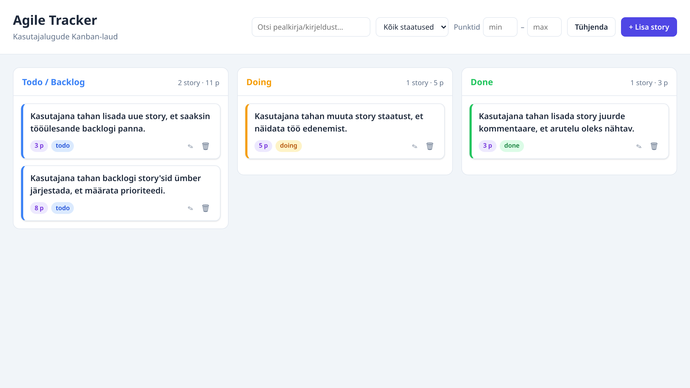

# Agile Tracker

Veebirakendus agiilse tarkvaraprojekti kasutajalugude (*story*'de) haldamiseks
Kanban-laual. Kolm veergu — **Todo / Backlog**, **Doing**, **Done** — kuhu saab
story'sid luua, muuta, kustutada ja lohistada. Backlogi järjekorda saab hiirega
muuta ja see säilib pärast lehe uuendamist. Kõiki andmeid haldab REST API.

Koolitöö (VIKK).



---

## 1. Mis tehnoloogiaid kasutasid?

| Kiht | Tehnoloogia |
| --- | --- |
| Backend | **Node.js** + **Express** (REST API) |
| Frontend | **Vanilla JavaScript** (ES-moodulid), HTML, CSS — ilma build-sammuta |
| Lohistamine | **SortableJS** (vendor'itud lokaalselt, töötab ka ilma internetita) |
| Andmete salvestus | **JSON-fail** (`data/stories.json`) |
| Testid | Node sisseehitatud testijooksja (`node --test`) + `fetch` |

Teadlik valik: ei kasutatud raamistikku ega andmebaasi, et kood oleks lihtne
lugeda ja rakendus käivituks ilma lisaseadistuseta.

## 2. Kuidas rakendus käivitada?

Eeldus: **Node.js ≥ 18** (arendatud Node 24-ga).

```bash
# 1. Klooni repo
git clone https://github.com/vikk-tak25/karl-agile-tracker.git
cd karl-agile-tracker

# 2. Paigalda sõltuvused
npm install

# 3. Käivita server
npm start
```

Seejärel ava brauseris **http://localhost:3000**.

Esmakäivitusel luuakse `data/stories.json` automaatselt näidisandmetest
(`data/seed.json`), nii et laud pole kunagi tühi. Pordi saab muuta keskkonna-
muutujaga, nt `PORT=4000 npm start`.

Automaattestide käivitamine:

```bash
npm test
```

## 3. Millised funktsioonid valmis said?

**Kohustuslik funktsionaalsus — kõik valmis:**

- ✅ Story'de kuvamine Kanban-laual (kolm veergu)
- ✅ Story lisamine (pealkiri, kirjeldus, punktid, vastuvõtutingimused)
- ✅ Story muutmine
- ✅ Story kustutamine
- ✅ Story staatuse muutmine (sh lohistades veergude vahel)
- ✅ Backlogi järjestamine hiirega lohistades — **järjekord püsib pärast lehe uuendamist**
- ✅ Punktide määramine (täisarv, mittenegatiivne, valideerimine + arusaadav veateade)
- ✅ Vastuvõtutingimuste lisamine (vähemalt üks nõutav)
- ✅ Kommentaaride lisamine koos ajatempliga
- ✅ Andmete salvestamine (JSON-fail)
- ✅ Story'de haldamine REST API kaudu (kõik nõutud endpointid)

**Lisavõimalused (lisapunktide jaoks) — valmis:**

- ✅ Korrektne ja arusaadav kujundus (värvikoodiga veerud, kaardid, modaalid)
- ✅ Story detailvaade (kirjeldus, vastuvõtutingimused, kommentaarid, kuupäevad)
- ✅ Otsing (pealkirja/kirjelduse järgi)
- ✅ Filtreerimine staatuse ja punktide vahemiku järgi
- ✅ Punktide summa iga veeru all
- ✅ Story loomise ja muutmise kuupäev (`createdAt` / `updatedAt`)
- ✅ Kommentaaride kustutamine
- ✅ Drag-and-drop story liigutamiseks **kõikide** veergude vahel
- ✅ Sobivad HTTP staatusekoodid API vigade korral (200/201/204/400/404)
- ✅ Lihtsad automaattestid REST API jaoks (13 testi)

## 4. Millised funktsioonid jäid pooleli?

Kõik ülesande nõuded said valmis. Pooleli ehk edasiarendusteks jäid
lisaideed, mis polnud ülesande skoobis:

- ⬜ Kasutajate autentimine ja mitme kasutaja tugi (praegu üks jagatud laud)
- ⬜ Mitu projekti / tahvlit
- ⬜ Story vastutaja, sildid (labels), tähtaeg
- ⬜ Kommentaari muutmine (praegu saab lisada ja kustutada)
- ⬜ Päris andmebaas (praegu JSON-fail; sobiks väikesele projektile, kuid
  paralleelsete kirjutamiste korral pole see lukustatud)
- ⬜ Kustutamise kinnitus ilusa modaaliga (praegu brauseri `confirm()`)

## 5. Millised olid kõige keerulisemad kohad?

- **Lohistamise ja püsivuse ühildamine.** Kõige keerulisem oli SortableJS-i
  ühendada REST API-ga nii, et nii **järjekord** (backlogi prioriteet) kui ka
  **staatus** (veerg) salvestuksid. Lahendus: pärast lohistamist saadab front
  serverisse uue järjekorra (`PATCH /reorder`) ja vajadusel staatuse muutuse
  (`PATCH /:id/status`), seejärel laeb andmed uuesti.
- **Klikk vs lohistamine.** Kaardile klõpsamine avab detailvaate, kuid pärast
  lohistamist tuli see klikk maha suruda (`suppressClickAfterDrag` lipp).
- **Marsruutide järjekord.** `PATCH /api/stories/reorder` ja
  `PATCH /api/stories/:id/status` ei tohtinud omavahel segi minna — lahenes
  erinevate teesegmentide arvuga.
- **Testide isolatsioon.** Et testid ei rikuks päris andmeid, suunatakse
  andmefail keskkonnamuutujaga `AGILE_DATA_FILE` ajutisse faili ja iga testi
  eel laetakse puhas seeme-andmestik.

---

## Projekti struktuur

```
karl-agile-tracker/
├── server.js              # Serveri sisenemispunkt (kuulab porti)
├── src/
│   ├── app.js             # Express-rakenduse seadistus, marsruutide ühendamine
│   ├── store.js           # JSON-failipõhine andmekiht (load/seed/persist)
│   ├── validation.js      # Story ja punktide valideerimine
│   ├── util.js            # Ajatempli abifunktsioon
│   └── routes/
│       └── stories.js     # Kõik /api/stories marsruudid
├── public/                # Frontend (serveeritakse staatiliselt)
│   ├── index.html
│   ├── css/styles.css
│   └── js/
│       ├── api.js         # REST API klient
│       ├── app.js         # UI loogika (laud, modaalid, lohistamine, filtrid)
│       └── vendor/Sortable.min.js
├── data/
│   ├── seed.json          # Näidisandmed (versioonihalduses)
│   └── stories.json       # Töödeldav andmefail (luuakse käivitusel, .gitignore'is)
├── tests/api.test.js      # REST API automaattestid
└── docs/screenshot.png    # Ekraanipilt töötavast lauast
```

## REST API endpointid

| Meetod | Endpoint | Kirjeldus |
| --- | --- | --- |
| `GET` | `/api/stories` | Tagastab kõik story'd (järjestatud prioriteedi järgi) |
| `GET` | `/api/stories/:id` | Tagastab ühe story; 404 kui puudub |
| `POST` | `/api/stories` | Loob uue story; 201 õnnestumisel, 400 valeandmete korral |
| `PUT` | `/api/stories/:id` | Muudab story't täielikult; 404/400 |
| `DELETE` | `/api/stories/:id` | Kustutab story; 204 õnnestumisel, 404 kui puudub |
| `PATCH` | `/api/stories/:id/status` | Muudab ainult staatust (`todo`/`doing`/`done`); 400 vale staatuse korral |
| `PATCH` | `/api/stories/reorder` | Salvestab uue järjekorra (`{ "order": [id, ...] }`) |
| `POST` | `/api/stories/:id/comments` | Lisab kommentaari ajatempliga; 400 tühja teksti korral |
| `DELETE` | `/api/stories/:id/comments/:commentId` | Kustutab kommentaari (bonus) |
| `GET` | `/api/health` | Tervisekontroll |

### Näidisandmestruktuur

```json
{
  "id": 1,
  "title": "Lisa story loomine",
  "description": "Kasutaja saab luua uue story.",
  "status": "todo",
  "points": 5,
  "priority": 1,
  "acceptanceCriteria": [
    "Kasutaja saab sisestada pealkirja.",
    "Story ilmub backlogi."
  ],
  "comments": [
    { "id": 1, "text": "Seda tuleb testida.", "createdAt": "2026-05-12 14:32" }
  ],
  "createdAt": "2026-05-12 09:00",
  "updatedAt": "2026-05-12 09:00"
}
```

## Arendusprotsess

Arendus käis GitHubis issue'de, feature-branch'ide ja mikrocommitidega: iga
funktsiooni jaoks loodi issue, selle jaoks eraldi branch (nimi algab issue
ID-ga, nt `8-lohistamine`), kus tehti väikseid commit'e ja iga branch liideti
`main`-i Pull Requesti kaudu (PR sulgeb vastava issue).
